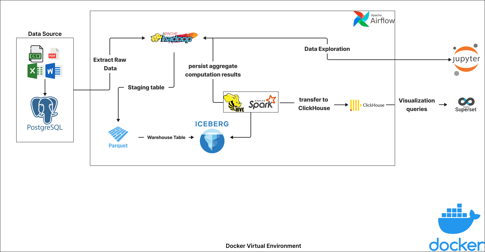

# Data lakehouse


### Hướng dẫn chạy sẽ được cập nhật sau

# Run:
0. Cài đặt các phụ thuộc bên ngoài:
- Cài đặt JDK 23: [https://download.oracle.com/java/23/latest/jdk-23.0.1_linux-aarch64_bin.tar.gz](https://download.oracle.com/java/23/latest/jdk-23.0.1_linux-aarch64_bin.tar.gz)  
- Cài đặt Hadoop 3.4.0: [https://dlcdn.apache.org/hadoop/common/hadoop-3.4.0/hadoop-3.4.0.tar.gz](https://dlcdn.apache.org/hadoop/common/hadoop-3.4.0/hadoop-3.4.0.tar.gz)  

Giải nén các tệp đã tải xuống vào thư mục `/services/airflow/dependencies`  

1. Thay đổi giá trị biến **IS_RESUME** trong tệp `./services/metastore/docker-compose.yml` thành `False`

2. Cấp quyền đầy đủ cho HDFS  
```  
sudo mkdir -p ./services/hadoop/data  
sudo chmod 777 ./services/hadoop/data/*  
```  

3. Tạo mạng Docker  
`docker network create fit_network`  

4. Khởi động Docker  
`bash start_all_service.sh`  